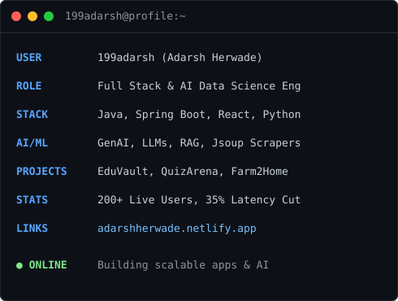
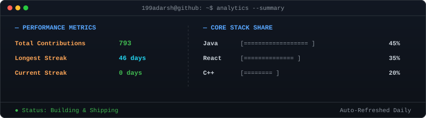

<div align="center">

<!-- Lora -->
<!-- Cormorant Garamond (thin & elegant) -->


<br/>

<div align="center">

🚀 <a href="https://adarshherwade.netlify.app/">Portfolio</a>
&nbsp;&nbsp;•&nbsp;&nbsp;
💼 <a href="https://www.linkedin.com/in/adarsh-herwade/">LinkedIn</a>
&nbsp;&nbsp;•&nbsp;&nbsp;
🧠 <a href="https://leetcode.com/u/19adarshh/">LeetCode</a>
&nbsp;&nbsp;•&nbsp;&nbsp;
📬 <a href="mailto:adarshherwade11214@gmail.com">Email</a>
&nbsp;&nbsp;•&nbsp;&nbsp;
⚡ <a href="https://github.com/199adarsh">GitHub</a>

</div>

</div>

<br/>


---

### About Me

- 🎓 &nbsp; Third-year **Artificial Intelligence & Data Science** undergraduate
- 💻 &nbsp; Full Stack Developer focused on **Java, Spring Boot, React and scalable backend systems**
- 🚀 &nbsp; Built real-time applications supporting **200+ users**
- 🤖 &nbsp; Exploring **AI Engineering, GenAI, LLMs and RAG Systems**
- 📚 &nbsp; Currently building **EduVault**, an AI-powered academic ecosystem for students
- 🌱 &nbsp; Passionate about learning, building and shipping useful software

```javascript
const favorites = [
  "💻 Building full stack + AI projects",
  "⚡ Optimizing performance & scalability",
  "🧠 Solving real-world problems",
  "🎮 Gaming & exploring tech"
];
```

<div align="center">




</div>

## Featured Projects

<details>
<summary><strong>EduVault</strong></summary>

A student-focused academic platform for notes, attendance, PYQs, roadmaps, and AI-assisted learning.

| Stack | Scale | Performance | Security | Impact | Repository |
|---|---|---|---|---|---|
| React, Spring Boot, Jsoup | College-level platform | Fast UI and structured data flow | Institution-controlled access patterns | Centralized academic workflow | [EduVault](https://github.com/199adarsh/EduVault) |

Built to make academic content easier to access, organize, and use in daily student workflows.

</details>

<details>
<summary><strong>DSSA QuizArena</strong></summary>

A realtime quiz platform built for live participation, synchronized scoring, and smooth event handling.

| Stack | Scale | Performance | Security | Impact | Repository |
|---|---|---|---|---|---|
| TypeScript, Firebase | 200+ participants | Live score synchronization | Firebase-backed access control | Smooth live quiz experience | [DSSA-QuizArena](https://github.com/199adarsh/DSSA-QuizArena) |

Designed for event usage where speed, stability, and clarity matter more than decoration.

</details>

<details>
<summary><strong>Smart Volunteering Portal</strong></summary>

An AI-powered volunteering system for task management, attendance tracking, and reporting.

| Stack | Scale | Performance | Security | Impact | Repository |
|---|---|---|---|---|---|
| HTML, Flask, Firebase, Gemini AI | Event / community scale | Realtime sync and low-latency handling | Google OAuth + Firebase auth | Better volunteer coordination | Private / On request |

Focused on modular workflows, async handling, and practical coordination for teams.

</details>

<details>
<summary><strong>Farm2Home</strong></summary>

An AI-enabled agri marketplace with secure authentication and recommendation support.

| Stack | Scale | Performance | Security | Impact | Repository |
|---|---|---|---|---|---|
| Flask, Firebase, Gemini AI | MVP / prototype | Efficient request handling | Firebase Authentication + Firestore | Smarter agri decision support | [Farm2Home](https://github.com/199adarsh/Farm2Home) |

Includes AI-based nutrition and pricing assistance to support better user decisions.

</details>

## Experience

### Software Development Volunteer | DSSA, Kolhapur
**Jun 2025 – Present**

- Built and maintained web applications supporting student communities, technical events, and organizational workflows.
- Designed a real-time quiz system with Firebase Realtime Database, supporting live participation and synchronized scoring for 200+ users.
- Led frontend development efforts for the DSSA Club platform, enhancing usability, responsiveness, and overall user experience.
- Reduced hackathon registration latency by 35% through frontend optimization and efficient asynchronous data handling.
- Applied modern engineering practices to deliver reliable, scalable, and user-centric digital experiences.

**Core Skills:** React · Firebase · JavaScript · UI/UX Engineering · Performance Optimization · Realtime Systems

## GitHub Analytics

<div align="center">



<br><br>



</div>
